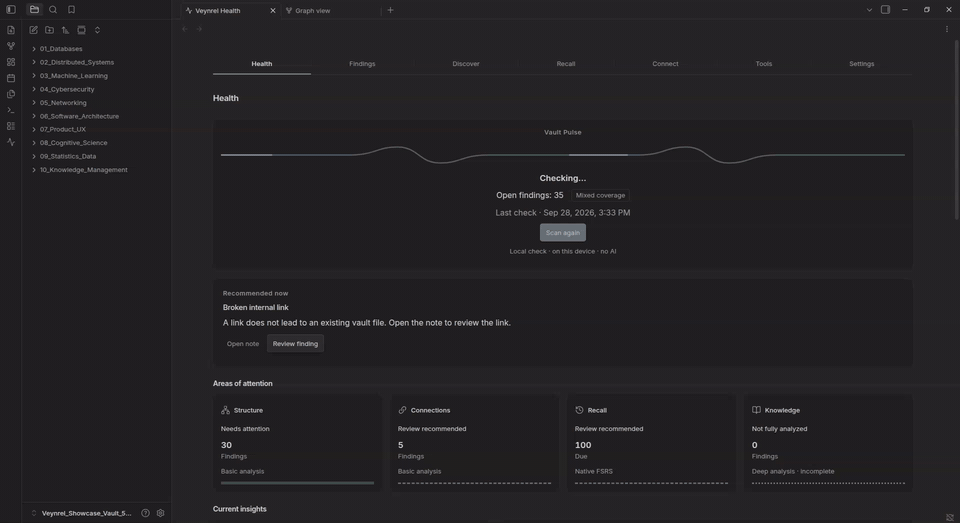
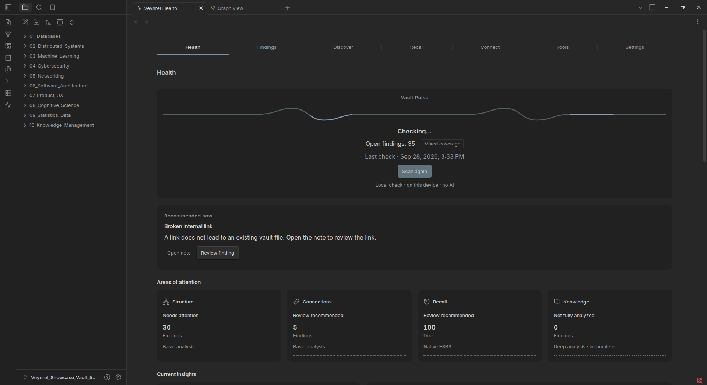
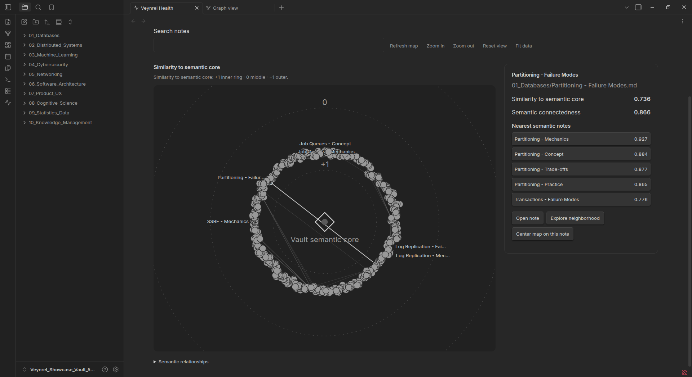
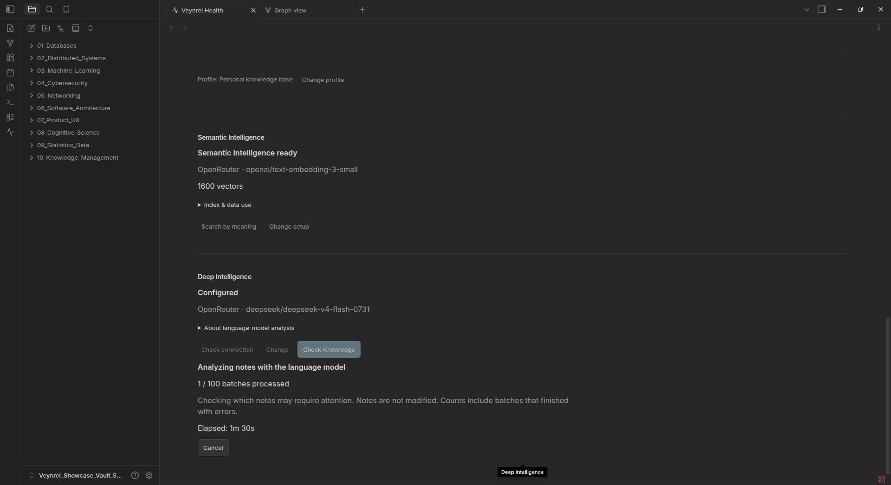
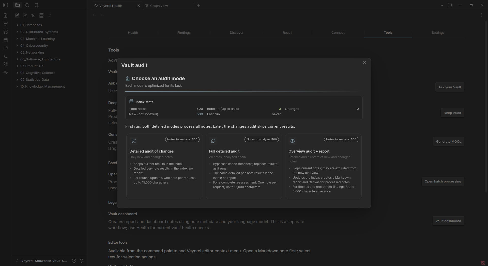

# Veynrel


<p align="center">
  <strong>See what needs attention in your Obsidian vault. Discover the connections you didn't explicitly create.</strong>
</p>

<p align="center">
  Knowledge health, semantic exploration and native spaced repetition for Obsidian.
</p>

<p align="center">
  <a href="https://github.com/zinverno/veynrel/releases">Releases</a>
  · <a href="https://github.com/zinverno/veynrel/stargazers">Star Veynrel</a>
  · <a href="LICENSE">MIT License</a>
</p>

<p align="center">
  
</p>

As your knowledge base grows, Veynrel helps you understand its state beyond folders and search results. Three primary concepts guide the workspace:

- **Health** surfaces broken links, structural problems and disconnected areas as reviewable findings.
- **Discover** offers semantic search, semantic neighborhoods and the Global Semantic Map.
- **Recall** provides native FSRS-6 spaced repetition.

Local Health and Recall work without an AI provider. Semantic and language-model features are optional and only run when explicitly configured and used.

## A look inside

Veynrel 2.0.1 in Obsidian. Select an image to inspect it at full size.

<table>
  <tr>
    <td width="50%" valign="top">
      <a href="assets/showcase/2.0.1/health-dashboard.png"></a>
      <br><strong>Health</strong> — see what needs attention and why.
    </td>
    <td width="50%" valign="top">
      <a href="assets/showcase/2.0.1/semantic-map.png"></a>
      <br><strong>Semantic Map</strong> — explore the structure of your indexed knowledge.
    </td>
  </tr>
  <tr>
    <td width="50%" valign="top">
      <a href="assets/showcase/2.0.1/knowledge-progress.png"></a>
      <br><strong>Knowledge Health</strong> — follow real analysis stages and progress on larger vaults.
    </td>
    <td width="50%" valign="top">
      <a href="assets/showcase/2.0.1/audit-modes.png"></a>
      <br><strong>Vault Audit</strong> — choose between changed-note, full detailed and overview workflows.
    </td>
  </tr>
</table>

## Quick start

1. [Install Veynrel](#installation), then use its ribbon icon or **Open Veynrel Health** command.
2. Choose a profile and **run local Health**. Inspect the recommendation and Findings; no AI provider is required.
3. Optionally enable **Semantic Intelligence**: choose an embedding provider/model, test the connection and explicitly build the first index.
4. Open **Discover** to explore Semantic Neighborhood, Global Semantic Map and Connection Opportunities.
5. If you want spaced repetition, add flashcards and choose **Find flashcards** in Recall.
6. Configure **Deep Intelligence** for Knowledge Health or advanced AI workflows, and **Connect** for Companion, only if needed.

## One workspace

```text
Health | Findings | Discover | Recall | Connect | Tools | Settings
```

| Page | What you can do |
| --- | --- |
| **Health** | See Vault Pulse, recommendations, four dimensions of knowledge health and Vault Topology. |
| **Findings** | Review evidence and decide what to address, dismiss or revisit. |
| **Discover** | Search by meaning, explore semantic maps and inspect connection candidates. |
| **Recall** | Review your flashcards with native FSRS-6 scheduling. |
| **Connect** | Configure Companion, synchronize its mirror and review external proposals. |
| **Tools** | Launch advanced audits, Ask your Vault, batch processing and MOC generation. |
| **Settings** | Check capability state and configure the services you use. |

## Health and Findings

**Vault Pulse → recommendation → current data.** Health shows concrete Findings and coverage instead of an opaque 0–100 score, across four dimensions:

- **Structure:** broken links, orphan notes, weak structure and disconnected areas.
- **Connections:** explicit relationships, exact duplicates and semantic duplicate findings.
- **Recall:** cards due for native review.
- **Knowledge:** explicit AI-assisted signals about underdeveloped notes.

The current-data dashboard brings findings, last-check information, Recall and Knowledge state together. **Vault Topology** lets you inspect actual Markdown links in a map with note details. The local Health scan requires no AI.

**Findings is your action inbox.** Review evidence, open affected notes, dismiss, snooze or reopen a Finding. Supported checks automatically resolve findings when a subsequent analysis confirms the issue has disappeared.

## Discover by meaning

- **Search & find:** semantic search, related notes and potential semantic duplicates.
- **Visual exploration:** Semantic Neighborhood, Global Semantic Map with selected-note focus, and Connection Opportunities.
- **Semantic Health:** explicitly check for semantic duplicates and review the resulting Findings.

These features reuse the existing semantic index. Similarity is a discovery signal, not proof that notes are identical or agree.

**Optional [Rerank v1](docs/rerank-v1.md)** refines explicit semantic searches through OpenRouter with your own separate API key. It is off by default, including upgrades. After showing the original results, Veynrel submits the query and one verified current fragment from each eligible candidate (up to 30 notes), then displays up to 10 results. Requests are billed to your OpenRouter account. Failures preserve eligible semantic results; the index, maps, RAG and Companion are unaffected. Quality depends on the candidates, selected model and available fragment—improvement is not guaranteed for every query.

**Optional [Decisions v1](docs/decisions-v1.md)** adds **Assess overlap** to potential duplicate pairs. Review two current fragments, then explicitly send exactly that text to OpenRouter using an independent model setting and API key. It is off by default, works independently of rerank, and makes no automatic vault or index changes. The five-category model assessment applies only to the displayed fragments; a shared topic or high confidence does not confirm a duplicate. Requests are billed to your account.

| Relationship view | What it shows |
| --- | --- |
| **Vault Topology** (Health) | The Markdown links you actually created. |
| **Semantic Neighborhood** | One note and its closest semantic neighbors. |
| **Global Semantic Map** | The whole eligible indexed semantic space, within the current map limit. |
| **Connection Opportunities** | Semantic top-5 relationships compared with explicit Markdown links. |

### Global Semantic Map

Distance from the center reflects semantic similarity to the current center: **closer means more similar**. The default center is the **vault semantic core**; any mapped note can explicitly become the focus, with a simple reset to the core.

Node size reflects **semantic connectedness**, not importance or note quality. Map exploration reuses existing embeddings and makes no new embedding requests. See the [map guide](docs/global-semantic-map.md) for details.

### Connection Opportunities

Inspect connection candidates with semantic evidence beside the Markdown relationship:

| Category | Meaning |
| --- | --- |
| **Candidate** | A semantic top-5 relationship with no known Markdown link in either direction. |
| **Aligned** | A semantic top-5 relationship that also has Markdown linkage. |
| **Explicit-only** | A Markdown-linked pair outside the sparse semantic top-5 graph. |

**Explicit-only does not mean semantically unrelated.** Candidates are invitations to inspect, not proof that a link should exist. Coverage notices identify relationships that could not be compared.

Review aids include mutual top-3, mutual top-5 and one-sided evidence; shared semantic neighbors; and an optional **Hide Excalidraw notes** presentation filter. Mark a candidate **Useful / Not useful / Unsure** during the current session. These annotations are not persisted, and no Markdown links are created automatically.

More: [Connection Opportunities](docs/connection-opportunities.md) · [candidate evidence and review](docs/connection-candidate-quality.md).

## Remember with Recall

Native spaced repetition uses **FSRS-6**, a due queue and local scheduling. No third-party spaced repetition plugin is required.

Write one `Question::Answer` card per line under a Markdown heading named exactly **`Flashcards`** (case-sensitive):

```markdown
## Flashcards

What is retrieval practice::Actively recalling information instead of rereading it
Why use spaced repetition::It schedules reviews near the point of forgetting
```

Choose **Find flashcards**, start a review, reveal the answer and rate **Again / Hard / Good / Easy** (keys **1–4**). Schedules survive restarts.

AI card generation is optional and explicit: it uses your configured language model and appends generated cards to the note for native Recall. [Recall guide](docs/recall-review-experience.md).

## Connect, Tools and Settings

**Connect** works with the optional, self-hosted [Veynrel Companion](https://github.com/zinverno/veynrel-companion). It makes a synchronized mirror available to MCP clients for note reading, semantic search and change proposals. External agents **cannot directly write your vault through the proposal workflow**: you inspect each proposal in Obsidian and choose **Approve** or **Reject**.

Manual mirror sync requires confirmation. Enabling Connect also permits disclosed incremental synchronization after subsequent semantic changes. The mirror can contain Markdown, chunk text, metadata and embeddings; use an endpoint you trust. [Connect data flow and setup](docs/veynrel-connect.md).

**Tools** keeps Ask your Vault, Deep Audit / Single Audit, batch processing, MOC generation and legacy reports available. Editor workflows—AI writing, selection transforms, Dataview generation and atomization—remain separate, through the command palette and editor context menu. Existing command IDs remain compatible with hotkeys and automation.

**Settings** summarizes Deep Intelligence, Semantic Intelligence, Connect and Recall. Native **Obsidian Settings → Veynrel** provides advanced provider/model, embedding, Companion, Deep Audit, output and interface controls.

Supported language-model providers include Ollama, OpenRouter, OpenAI, Groq and custom OpenAI-compatible endpoints. Embeddings support Ollama, OpenRouter and OpenAI-compatible endpoints. Language-model, embedding and Companion credentials are separate.

## Local-first, explicit AI

| Activity | Where the work happens |
| --- | --- |
| Local Health and Vault Topology | On your device; no AI provider required. |
| Recall discovery and scheduling | Locally, using native FSRS-6. |
| Semantic indexing / search | A remote embedding provider receives required note chunks / the search query. A local Ollama endpoint can keep embedding work local. |
| Semantic maps / connection comparison | Existing index and link metadata; no new embeddings or provider calls. |
| Knowledge Health / AI workflows | Explicit actions send the content needed for the task to your configured language model. |
| Connect | The disclosed mirror goes to your configured Companion endpoint; proposed vault changes require Obsidian approval. |

Opening the workspace does not itself scan, build an index, call a provider or synchronize Companion. The first semantic build is explicit; later Markdown edits can update an existing index incrementally. A local vector index does not make a remote provider local.

Veynrel has no telemetry or analytics. Provider API keys are not sent to Companion, and the Companion token is not sent to AI providers. Review the policies of remote services before sending sensitive notes. Data-flow, storage and recovery details are in [`docs/`](docs/).

## Installation

### Obsidian Community Plugins

1. Open **Settings → Community plugins → Browse**.
2. Search for **Veynrel**.
3. Install and enable it.

### Manual installation

Download exactly these three files from the same [GitHub Release](https://github.com/zinverno/veynrel/releases):

```text
main.js
manifest.json
styles.css
```

Place them in:

```text
<your-vault>/.obsidian/plugins/ai-knowledge-hub/
```

Reload Obsidian and enable Veynrel.

### Updating

The plugin ID remains **`ai-knowledge-hub`**. Existing users update normally; do not create a second `veynrel` plugin folder. Compatible settings and feature data continue to use the existing plugin directory.

## How it fits together

```text
Obsidian vault
├─ Local Health → Findings
│                Vault Topology
├─ Semantic Index → Search / Related / Duplicates
│                   Semantic Neighborhood
│                   Global Semantic Map → Selected-note focus
│                   Connection Opportunities ← Markdown links
├─ Recall → FSRS-6
├─ Deep Intelligence → Knowledge Health / advanced AI workflows
└─ Connect → Companion / MCP → proposals → approval in Obsidian
```

**Analysis may suggest. Veynrel shows evidence. You decide.**

## Current limitations

- The first semantic build and rebuilds after incompatible embedding-space changes are explicit.
- Global Semantic Map exact mode supports **up to 500 eligible mapped notes**; Connection Opportunities shares that limit.
- Connection Opportunities uses a sparse **top-5** semantic graph. It cannot prove a Markdown link should exist; candidate reviews are **session-only**, not persisted.
- Recall has no decks, review-history views or optimizer analytics.
- Semantic search uses a local linear scan; duplicate detection uses pairwise comparison suited to personal vault sizes.
- Ask your Vault is a one-shot flow, and Knowledge Health is an AI-assisted review signal, not factual verification.
- Companion remains **self-hosted**, with no hosted Veynrel account service.
- Verification of the newer visual/native surfaces is strongest on **Linux desktop**. Mobile and other desktop environments are not equally covered for every surface.

## Development and contributing

```bash
npm ci
npm test
npm run typecheck
npm run lint
npm run audit:proposals
npm run build
```

Veynrel and Companion are separate repositories. For integration development, clone [Companion](https://github.com/zinverno/veynrel-companion) beside this repository as `../veynrel-companion`, then run `npm run companion:smoke-sibling`.

See [`docs/`](docs/) for architecture and storage contracts, or the [final UI/UX audit](docs/final-product-ui-ux.md) for native verification and known interface limitations. Issues, bug reports and pull requests are welcome.

## Support Veynrel

Veynrel is free and open source. [Star the repository](https://github.com/zinverno/veynrel/stargazers) or [support development on Boosty](https://boosty.to/veynrel).

## License

[MIT](LICENSE) © 2026 Zinvernix
