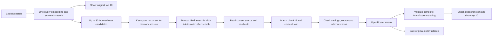

# Rerank v1: optional Discover search refinement

Rerank reorders candidates from an explicit **Discover → Semantic search** or **Veynrel: Semantic search** command. It does not find notes outside the semantic candidate pool. Quality depends on that pool, the selected model, and the one fragment available to the model; improvement is not guaranteed for every query. Mock and connection tests establish integration behavior, not ranking quality.

## Setup and privacy

In Veynrel plugin settings, next to Semantic Intelligence, configure **Search refinement / Rerank**:

1. Read the disclosure, enter an explicit OpenRouter rerank model ID and a separate API key, and enable refinement. New installations default to **off/manual**. Existing enabled installations keep automatic behavior; see migration below.
2. `cohere/rerank-v3.5` is a starting example in the official documentation checked on 2026-10-07, not a recommendation or a pricing promise. There is no invented model catalog. Chat/embedding model IDs are not substituted.
3. **Test rerank** is optional and explicit. It makes a billable API request using only “Which fruit is yellow?” and two fixed synthetic sentences. Opening settings never tests a provider.

### Manual and automatic modes

**When should results be refined?** has two choices: **Manually, with a button** and **Automatically after searching**. In manual mode:

1. Open the existing Semantic Search, enter a query and press **Search**. One query embedding retrieves up to 30 candidates and displays the original top 10. No Rerank or source reconstruction happens yet.
2. Click **Refine results** under the results. Its disclosure says: “Sends the search query and selected fragments to OpenRouter. The request may incur a charge.” This explicit action prepares current fragments and refines the saved pool without another semantic search or embedding request.
3. During refinement, originals remain visible; the button is disabled against double clicks, while search and close remain usable. Success reports actual candidate coverage, not a promise of improved relevance.
4. Switch **Original order / After refinement** locally, with no additional API request. A failure preserves originals and offers another explicit click; the retry disclosure states that it may be charged again. With no model/key, the UI gives the settings path instead of a dead button.

Automatic mode runs the same refinement stage immediately after each explicit search. Disabling Rerank retains the original limit of 10 with no extra source reads. Typing, viewing results, opening Discover/settings and changing modes never launch Rerank. **Test rerank** remains a separate billable action.

The [hard benchmark](rerank-hard-benchmark-v1.md) found 11 improvements, 11 unchanged cases and 2 regressions among 24 positive queries (nDCG@10). Embeddings already placed a relevant document first on 23/24. This motivates user-controlled refinement; no query difficulty heuristic or automatic model substitution is added.

### Settings migration

| Stored settings | Mode after loading |
| --- | --- |
| New installation / absent Rerank settings | Off, manual |
| Enabled, no `triggerMode` | Automatic |
| Disabled, no `triggerMode` | Manual |
| Explicit `manual` or `automatic` | Preserved, regardless of enablement |

`triggerMode` does not replace the existing model ID or key. Its writes use the existing settings save queue and nested rollback; a failed save restores the prior value and invalidates pending refinement again. Mode changes never rebuild or invalidate the semantic index.

Before enabling, the UI explains:

> Для уточнения поиска запрос и выбранные текстовые фрагменты отправляются в OpenRouter и провайдеру выбранной модели. Запросы оплачиваются с вашего аккаунта.

The masked field uses a dedicated key stored in the plugin's existing local settings file, without encryption. No key is inherited from chat or embeddings. Keep that settings file private. This mode is neither fully local nor anonymous; no claims are made about provider retention or training. Consult the services' terms. Veynrel does not fund requests or create accounts, subscriptions, quotas or a backend.

The only outbound fields are `model`, `query`, `documents` (plain text strings), `top_n`, and `provider.allow_fallbacks: false`; the key is a bearer header. No separate paths, chunk IDs, user/session/trace metadata, or telemetry are sent. A fragment may itself contain a heading, link, path, or other private content from the note. Keys, queries, fragments and provider error bodies are not logged. There is no persistent query/text cache.

The plugin does not add filenames, folder names or paths as service context to Rerank fragments. After validating the original chunk ID/content hash, it composes outbound text from the same parsed blocks and overlap, omitting filename-derived fallback breadcrumbs. This covers headerless notes, introductions and empty headings, including truncated fallback names. Authored headings remain context, and names or paths literally written in the note are preserved. This is **not anonymization**. Conversion precedes the 4,000-code-point cap and JSON size calculation; missing provenance leaves the candidate unscored, with no fallback to enriched text or the whole note.

Legacy chunk text, identities/hashes, source coordinates, embedding inputs and serialized index remain compatible; no automatic rebuild occurs. Decisions uses the same outbound rule. Other flows such as embeddings, RAG and Companion retain their existing text/metadata behavior; this is not a plugin-wide filename-exclusion claim.

## Data flow and boundaries



`ObsidianSemanticController.searchDiscover` obtains candidates once. `rerank/refinedSearch.ts::refineCandidates` accepts that saved pool and shares preparation, payload limits, fallback, index mapping and sorting between manual and automatic modes. The existing `refinedSearch` wrapper remains available to evaluation drivers. The manual UI receives a session ID and an action capability, not the 30-document pool or settings/credentials. The ordinary controller/runtime/search-service methods retain their existing behavior. Runtime preparation uses the same `MarkdownDocumentSource` and `MarkdownChunker` as indexing and RAG. `chunking/reconstructChunks.ts` contains the existing RAG validity checks, extracted without changing RAG selection behavior.

The adapter calls the dedicated [OpenRouter rerank endpoint](https://openrouter.ai/docs/api/api-reference/rerank/submit-a-rerank-request): `POST https://openrouter.ai/api/v1/rerank`, using Obsidian `requestUrl`, with no SDK or chat-completions emulation.

Each candidate contributes its highest-scoring usable match among the existing maximum three semantic matches. The current chunk must have the indexed `id` and `contentHash`. The preview is never treated as chunk text; old offsets are never used to reconstruct it. Missing/unreadable/stale chunks are not replaced with the whole note. Existing extra matches remain visible. Successful refinement retains the chosen chunk's current source coordinates for note navigation.

Only the original indexed candidates inside the existing Markdown source are considered. v1 does not introduce or expand processing scope. Deleted/moved notes are filtered from both refinement and fallback. Unreadable or stale fragments may leave an existing note unscored. There is no whole-vault text read for rerank. Revisions are checked across text reads, immediately before HTTP, and before applying its response. Any vault event conservatively invalidates the saved session, including an unrelated note change. Its snapshot contains the trimmed query, Rerank settings/revision, semantic configuration, selected runtime, vector generation, source revision and a session ID. Input edits, a new search, close, settings/index/source changes and plugin unload abort waiting and release the pool; nothing is persisted for the session. The UI says “Результаты устарели. Выполните поиск заново” and does not search again automatically.

Rerank settings live separately from embeddings. Changing enablement, trigger mode, key or model does **not** change embedding-space identity, index format, indexing, index bytes or generation, and never requests a rebuild. Health, Recall, maps, neighbors, duplicates, Ask your Vault/RAG, and Companion do not call rerank. Workspace/settings entry, indexing and typing do not call it either.

## v1 limits

These are product limits, not asserted OpenRouter API limits.

| Item | Limit / behavior |
| --- | --- |
| Candidate notes | 30 from one semantic search, retaining up to three original matches per note |
| Submitted text | One best usable fragment per note; at least two documents to call rerank |
| Displayed results | 10, applied locally after sorting |
| Query | 2,000 Unicode code points after trimming, same as semantic search; longer input is rejected by the base search, not silently truncated |
| One fragment | First 4,000 Unicode code points; deterministic prefix truncation, no split surrogate pair; not a grapheme-cluster guarantee |
| Outbound body | 131,072 bytes of UTF-8 serialized JSON, including escaping, model and all fields; candidates that do not fit are left unscored |
| Model ID | At most 200 ASCII characters; explicit `provider/model` syntax |
| HTTP wait | 15 seconds, no automatic retries |

The current default chunker already bounds chunks more tightly (1,800 UTF-16 units); the 4,000-code-point cap is an additional outbound boundary. All actually submitted documents are requested via `top_n = documents.length`. Request index → local note → chunk → original position stays local. Provider-returned document text and paths are ignored.

Responses require a model string and exactly `top_n` result entries, unique in-range integer indices and finite numeric `relevance_score` values. No assumed score range is imposed. Results sort by relevance score descending, with original semantic order for ties. Scores remain separate (`rerankScore`); the UI continues to show the original semantic score, never a rerank probability or percentage. Unscored eligible notes follow the scored group in their original relative order. The status reports partial candidate coverage, even when those notes fall outside the final top 10.

## Errors, cancellation and fallback

The search UI distinguishes base search, refinement in progress, success, partial coverage, skip and fallback. Original results appear before rerank completes, and the input becomes usable while refinement is pending. A new query or input edit invalidates the previous refinement; typing itself does not search.

If rerank is unconfigured, there are fewer than two usable fragments, or the snapshot changes, the status explains the skip. Authentication/permission (401/403), credits (402), rate limit (429), server errors, network failures, timeout, empty JSON, malformed or incomplete responses produce safe fallback. No partial provider ranking is applied. The original eligible top 10 is taken from the saved candidate pool without a second embedding/search; deleted/excluded notes are not reintroduced. A base embedding-provider failure remains a search error.

The search fallback message is:

> Не удалось уточнить результаты. Показана исходная выдача.

Connection testing uses fixed localized error categories, never raw error bodies. There are no hidden retries or alternate models/services. The native transport cannot abort HTTP: timeout/cancellation **stops waiting and ignores late replies**, and does not guarantee that the provider stops processing or billing. Changing settings, disabling rerank, closing the search UI and unloading the plugin invalidate active requests. Index revisions also prevent application to another snapshot. No index barrier is held during external rerank HTTP.

## Verification and manual acceptance

Automated tests use fake transports only. Provider-contract tests cover payload bounds/Unicode, index validation, safe errors, timeout/cancellation and synthetic tests. Orchestration/runtime tests cover reconstruction, partial coverage, one embedding, fallback, lifecycle races, index independence and capability boundaries. UI tests cover stages, literal rendering, navigation and old responses. Frozen legacy settings assertions still verify existing defaults and callbacks, projecting out only the additive rerank property.

Native fake harness: `scripts/rerank-native.mjs`, with the manual scenario in `scripts/manual-rerank-native.mjs`:

```sh
npm run build
node scripts/rerank-native.mjs prepare /tmp/veynrel-manual-rerank-v1 manual
# Launch installed Obsidian with this isolated profile and loopback CDP 9261:
/usr/bin/electron43 /usr/lib/obsidian/app.asar --user-data-dir=/tmp/veynrel-manual-rerank-v1/profile --remote-debugging-port=9261 --remote-debugging-address=127.0.0.1 --disable-gpu --ozone-platform=x11
# In another terminal:
node scripts/rerank-native.mjs run /tmp/veynrel-manual-rerank-v1 manual
```

Adjust the installed Obsidian executable path for your system. Use an unused localhost port or stop the previous isolated process before restarting. The driver checks the synthetic vault path before changing settings, substitutes the production adapter's transport, and starts a localhost synthetic embedding server. No real credentials are loaded and no live API is used. Omit `manual` to run the older automatic fake scenario. Historical [v1 evidence](rerank-v1-evidence/verification.md), [live comparison #73](rerank-live-model-comparison.md) and [hard benchmark #74](rerank-hard-benchmark-v1.md) remain separate from [manual UX verification](manual-rerank-ux-v1.md).

Manual acceptance in the fake synthetic vault:

1. With off/manual defaults, enable Rerank using the fake transport and synthetic key; leave the chosen model ID unchanged. Search twice: ten results each time, zero Rerank calls.
2. Click **Refine results** once: originals remain visible while waiting, one Rerank call receives up to 30 saved candidates, no extra embedding call. Double-clicking must not send again.
3. Switch both orders with mouse and keyboard; inspect the unchanged semantic score and open the selected note/fragment. No toggle sends a request.
4. Force a fake failure: retain originals, show the retry-cost disclosure, and retry only on a separate click.
5. Edit the query during a delayed response, start a new search, close the modal, change mode/key/model, or edit/delete a note. Reject stale replies and require an explicit new search.
6. Change to automatic, reopen search and verify its previous behavior; switch back to manual. Check RU/EN and 390 px, and confirm index identity is unchanged.

No live-model request is needed for this UX acceptance. Synthetic fake embeddings and rerank scores validate control flow, not ranking quality. See the linked historical experiments for model results; none were repeated for manual UX.
