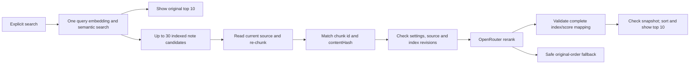

# Rerank v1: optional Discover search refinement

Rerank reorders candidates from an explicit **Discover → Semantic search** or **Veynrel: Semantic search** command. It does not find notes outside the semantic candidate pool. Quality depends on that pool, the selected model, and the one fragment available to the model; improvement is not guaranteed for every query. Mock and connection tests establish integration behavior, not ranking quality.

## Setup and privacy

In Veynrel plugin settings, next to Semantic Intelligence, configure **Search refinement / Rerank**:

1. Read the disclosure, enter an explicit OpenRouter rerank model ID and a separate API key, and enable refinement. It is **off by default**, including upgrades.
2. `cohere/rerank-v3.5` is a starting example in the official documentation checked on 2026-10-07, not a recommendation or a pricing promise. There is no invented model catalog. Chat/embedding model IDs are not substituted.
3. **Test rerank** is optional and explicit. It makes a billable API request using only “Which fruit is yellow?” and two fixed synthetic sentences. Opening settings never tests a provider.

Before enabling, the UI explains:

> Для уточнения поиска запрос и выбранные текстовые фрагменты отправляются в OpenRouter и провайдеру выбранной модели. Запросы оплачиваются с вашего аккаунта.

The masked field uses a dedicated key stored in the plugin's existing local settings file, without encryption. No key is inherited from chat or embeddings. Keep that settings file private. This mode is neither fully local nor anonymous; no claims are made about provider retention or training. Consult the services' terms. Veynrel does not fund requests or create accounts, subscriptions, quotas or a backend.

The only outbound fields are `model`, `query`, `documents` (plain text strings), `top_n`, and `provider.allow_fallbacks: false`; the key is a bearer header. No separate paths, chunk IDs, user/session/trace metadata, or telemetry are sent. A fragment may itself contain a heading, link, path, or other private content from the note. Keys, queries, fragments and provider error bodies are not logged. There is no persistent query/text cache.

## Data flow and boundaries

`rerank/refinedSearch.ts` orchestrates the explicit scenario through `ObsidianSemanticController.searchDiscover`. The ordinary controller/runtime/search-service methods retain their existing behavior. Runtime preparation uses the same `MarkdownDocumentSource` and `MarkdownChunker` as indexing and RAG. `chunking/reconstructChunks.ts` contains the existing RAG validity checks, extracted without changing RAG selection behavior.

The adapter calls the dedicated [OpenRouter rerank endpoint](https://openrouter.ai/docs/api/api-reference/rerank/submit-a-rerank-request): `POST https://openrouter.ai/api/v1/rerank`, using Obsidian `requestUrl`, with no SDK or chat-completions emulation.

Each candidate contributes its highest-scoring usable match among the existing maximum three semantic matches. The current chunk must have the indexed `id` and `contentHash`. The preview is never treated as chunk text; old offsets are never used to reconstruct it. Missing/unreadable/stale chunks are not replaced with the whole note. Existing extra matches remain visible. Successful refinement retains the chosen chunk's current source coordinates for note navigation.

Only the original indexed candidates inside the existing Markdown source are considered. v1 does not introduce or expand processing scope. Deleted/moved notes are filtered from both refinement and fallback. Unreadable or stale fragments may leave an existing note unscored. There is no whole-vault text read for rerank. Revisions are checked across text reads, immediately before HTTP, and before applying its response. Any vault event conservatively invalidates pending refinement, including an unrelated note change; retry with an explicit search.

Rerank settings live separately from embeddings. Changing enablement, key or model does **not** change embedding-space identity, index format, indexing, index bytes or generation, and never requests a rebuild. Health, Recall, maps, neighbors, duplicates, Ask your Vault/RAG, and Companion do not call rerank. Workspace/settings entry, indexing and typing do not call it either.

## v1 limits

These are product limits, not asserted OpenRouter API limits.

| Item | Limit / behavior |
| --- | --- |
| Candidate notes | 30 from one semantic search, retaining up to three original matches per note |
| Submitted text | One best usable fragment per note; at least two documents to call rerank |
| Displayed results | 10, applied locally after sorting |
| Query | 2,000 Unicode code points after trimming, same as semantic search; longer input is rejected by the base search, not silently truncated |
| One fragment | First 4,000 Unicode code points; deterministic prefix truncation, no split surrogate pair; not a grapheme-cluster guarantee |
| Outbound body | 131,072 bytes of UTF-8 serialized JSON, including escaping, model and all fields; candidates that do not fit are left unscored |
| Model ID | At most 200 ASCII characters; explicit `provider/model` syntax |
| HTTP wait | 15 seconds, no automatic retries |

The current default chunker already bounds chunks more tightly (1,800 UTF-16 units); the 4,000-code-point cap is an additional outbound boundary. All actually submitted documents are requested via `top_n = documents.length`. Request index → local note → chunk → original position stays local. Provider-returned document text and paths are ignored.

Responses require a model string and exactly `top_n` result entries, unique in-range integer indices and finite numeric `relevance_score` values. No assumed score range is imposed. Results sort by relevance score descending, with original semantic order for ties. Scores remain separate (`rerankScore`); the UI continues to show the original semantic score, never a rerank probability or percentage. Unscored eligible notes follow the scored group in their original relative order. The status reports partial candidate coverage, even when those notes fall outside the final top 10.

## Errors, cancellation and fallback

The search UI distinguishes base search, refinement in progress, success, partial coverage, skip and fallback. Original results appear before rerank completes, and the input becomes usable while refinement is pending. A new query or input edit invalidates the previous refinement; typing itself does not search.

If rerank is unconfigured, there are fewer than two usable fragments, or the snapshot changes, the status explains the skip. Authentication/permission (401/403), credits (402), rate limit (429), server errors, network failures, timeout, empty JSON, malformed or incomplete responses produce safe fallback. No partial provider ranking is applied. The original eligible top 10 is taken from the saved candidate pool without a second embedding/search; deleted/excluded notes are not reintroduced. A base embedding-provider failure remains a search error.

The search fallback message is:

> Уточнение недоступно. Показаны результаты семантического поиска.

Connection testing uses fixed localized error categories, never raw error bodies. There are no hidden retries or alternate models/services. The native transport cannot abort HTTP: timeout/cancellation **stops waiting and ignores late replies**, and does not guarantee that the provider stops processing or billing. Changing settings, disabling rerank, closing the search UI and unloading the plugin invalidate active requests. Index revisions also prevent application to another snapshot. No index barrier is held during external rerank HTTP.

## Verification and manual acceptance

Automated tests use fake transports only. Provider-contract tests cover payload bounds/Unicode, index validation, safe errors, timeout/cancellation and synthetic tests. Orchestration/runtime tests cover reconstruction, partial coverage, one embedding, fallback, lifecycle races, index independence and capability boundaries. UI tests cover stages, literal rendering, navigation and old responses. Frozen legacy settings assertions still verify existing defaults and callbacks, projecting out only the additive rerank property.

Native harness: `scripts/rerank-native.mjs`. Run `npm run build`, then `node scripts/rerank-native.mjs prepare /tmp/veynrel-rerank-native`. Launch a separate Obsidian process using `/tmp/veynrel-rerank-native/profile` and `--remote-debugging-port=9261`. Run `node scripts/rerank-native.mjs run /tmp/veynrel-rerank-native`. It uses a localhost synthetic embedding endpoint and replaces the rerank adapter transport in the disposable native process. It never needs real credentials. See [verification evidence](rerank-v1-evidence/verification.md) for actual results and remaining gaps.

Manual acceptance on a disposable vault:

1. Load the plugin with an existing semantic index and old settings. Confirm rerank is off, normal search works, and opening Discover/settings makes no rerank request.
2. Enter an explicit rerank model and your separate OpenRouter key. Read the disclosure and enable. **Only with your own consent to billing**, click Test rerank; confirm its synthetic request succeeds or shows a safe error.
3. Search from Discover and from the plugin command. Observe original results → refinement → ordered results or fallback. Open a result and verify the selected fragment position. Check English and Russian UI.
4. Use a wrong key/model, insufficient credits or a controlled transport failure. Confirm original semantic order and the fallback message. Break the embedding configuration separately; confirm that remains a base-search error.
5. During a delayed request, start a new search, close the modal, disable rerank, change model/key, and modify/delete/rename a candidate. Old replies must not reorder the current results or restore removed notes.
6. Compare index bytes/identity before and after rerank settings changes; maps, RAG and Companion should behave as before.

The [Russian/English synthetic evaluation set](rerank-v1-evaluation.json) is for later manual live-model evaluation. Record the model/date, original candidates and fragment coverage, semantic order, reranked order, relevance judgment and failures. Include unsuccessful or ambiguous cases. No live quality measurements are claimed by this PR; production behavior is not fitted to this set.

Decisions, cloud infrastructure, accounts, quotas and release publication are outside this stage.
